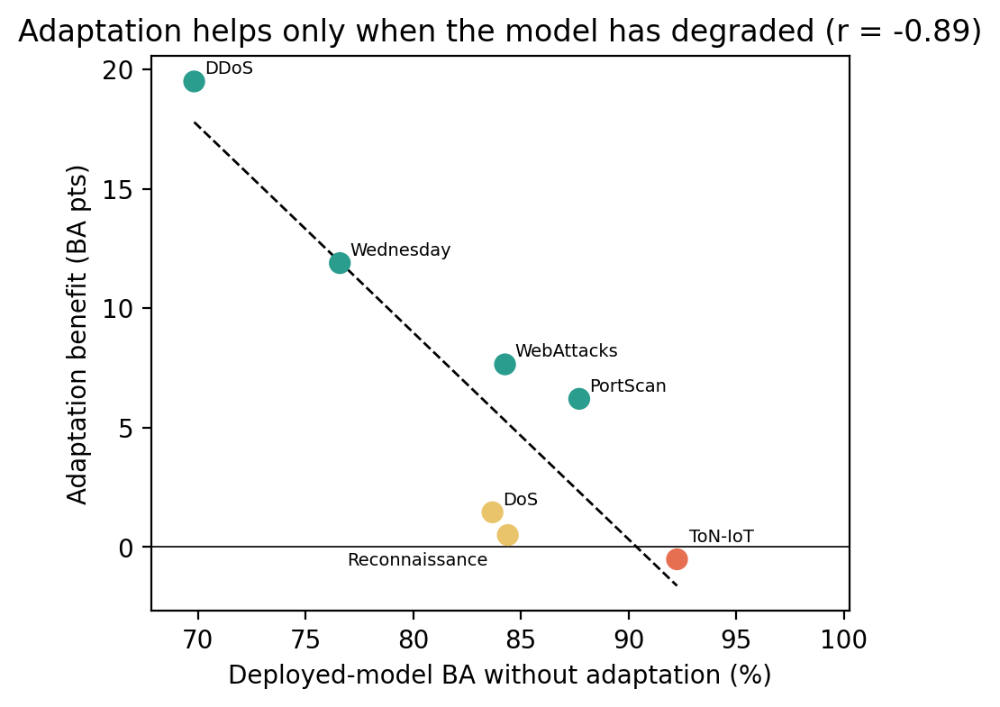

# Validate Before Commit

**Label-Efficient Empirical Gating of Drift-Triggered Classifier Updates for Network Intrusion Detection**


[](https://doi.org/10.5281/zenodo.21322256)


Machine-learning intrusion detectors degrade under network **concept drift**, so adaptive systems retrain their
classifiers. The field treats *when to retrain* as a **drift-detection** problem: fire a monitor, retrain on
the alarm. This repository shows that framing is incomplete and sometimes harmful — and provides a small,
deployable fix.

> **Drift detectors answer "did the distribution change?". An adaptive IDS needs "will retraining improve the
> classifier?". These are different questions — and the gap between them is where harmful retraining lives.**

---

## TL;DR

- Across **three public benchmarks** (CICIDS2017, UNSW-NB15, ToN-IoT) and multiple attack regimes, the value of
  drift-triggered retraining spans **+19.5 to −4.5 balanced-accuracy points**. For a fragile downstream model,
  *never adapting* can beat every triggered strategy.
- Whether retraining helps is governed by **how degraded the deployed model already is**: retraining restores
  accuracy to a nearly regime-invariant level, so the benefit is the deployed model's *headroom* — a quantity a
  drift detector cannot observe (within a deployment, detector scores are uninformative about the gain, r ≈ 0.06).
  The detector — classical two-sample test or quantum-kernel MMD — is **not the lever**.
- Simple confirmation/cooldown policies and a 50/50 replay strategy do **not** fix it (pre-specified negatives).
- **The fix:** a label-efficient **validate-before-commit gate** — on each triggered drift, retrain a candidate
  but deploy it **only if it beats the incumbent on a small labeled probe** (tens of labeled flows). It is
  evaluated under pre-specified criteria with 30-seed 95% CIs, generalizes across two detectors (with SVC) and
  four downstream models (with KS-max), tolerates label latency and natural-prevalence probes, and **fails safe
  under randomly corrupted validation labels**.

---

## Key findings

**1 — Readaptation is regime-dependent and sometimes harmful.**


**2 — Retraining restores accuracy to a nearly regime-invariant level, so the benefit of adaptation is the deployed model's headroom (coupling-aware analysis in the paper, §5.2).**



**3 — The validate-before-commit gate preserves benefit, avoids harm, and beats both naive retraining and
never-adapting — identically for a classical (KS-max) and a quantum (QK-ZZ) detector.**


**4 — The gate fails safe: with up to 40% of validation labels randomly flipped it never becomes harmful and is
never significantly worse than naive.**


---

## Results at a glance (ToN-IoT harm regime, 30 seeds, pre-specified criteria)

| Detector | naive retraining | **validate-before-commit gate** | gate vs naive (CI95) | gate vs never-adapt (CI95) |
|---|---:|---:|---|---|
| KS-max (classical) | −1.36 | **+0.93** | +2.30 [1.15, 3.63] | +0.93 [0.53, 1.36] |
| QK-ZZ (quantum) | −3.69 | **+1.06** | +4.74 [2.47, 7.69] | +1.06 [0.77, 1.40] |

Balanced-accuracy points vs. no-adaptation. The gate converts net-harmful retraining into net benefit with
~100 labeled flows; a **label-budget sweep** shows as few as ~8 labels per confirmed drift already avoid harm.

---

## The method

On every triggered drift the gate retrains a **candidate** model as usual, but **commits it only if it beats
the deployed model on a small labeled probe** drawn from current traffic (default 32 flows); otherwise the
incumbent is kept. Two ablations delimit the method: a **zero-label** variant (commit on model disagreement)
fails — a few labels are necessary — and simple **k-of-n / cooldown** policies fail because they act on
distributional change rather than estimated model improvement. See `manuscript/` §3 (Algorithm 1) for the
full specification.

Enabled by flags on the experiment runner:
`--adaptation-gate {none,labeled_probe,unsup_disagree}`, `--probe-size`, `--probe-lag`, `--probe-poison`,
`--gate-margin`, `--downstream-model {svc_rbf,random_forest,logreg,mlp}`.

---

## Repository structure

```
manuscript/     Manuscript draft (§1–§8) + references.bib
src/experiments/  Progressive-drift readaptation runner (detectors, gate, downstream models)
src/analysis/     Reproducible aggregation, statistics, tables and figures
results/          Generated tables/figures (git-ignored; rebuilt by the scripts)
data/             Public benchmark datasets (git-ignored; see Data availability)
docs/img/         Figures used in this README
notes/            Protocols, pre-registrations, and checkpoints
REPRODUCE.md      One-command regeneration of every table and figure
```

## Reproducing the results

```bash
conda create -n paper2 python=3.11 -y && conda activate paper2
pip install -r requirements.txt
# place the datasets under data/ (see below), then:
python -m src.analysis.make_paper2_paper_tables    # Tables 1–6 (Markdown + LaTeX)
python -m src.analysis.make_paper2_figures         # Figures 1–4
python -m src.analysis.make_paper2_budget_curve    # label-efficiency frontier
python -m src.analysis.make_paper2_gate_robustness # latency / harm-breadth / margin / poison
```

Full details, including the exact experiment commands and a claim → artifact map, are in
[`REPRODUCE.md`](REPRODUCE.md). The confirmatory Phase 2 protocol was pre-specified in
[`notes/paper2_phase2_gated_readaptation_preregistration_001.md`](notes/paper2_phase2_gated_readaptation_preregistration_001.md).

## Data availability

The three public benchmarks are **not redistributed** here (place them under `data/`):

- **CICIDS2017** — Sharafaldin, Lashkari & Ghorbani, *ICISSP* 2018.
- **UNSW-NB15** — Moustafa & Slay, *MilCIS* 2015.
- **ToN-IoT** — Alsaedi et al., *IEEE Access* 2020.

## Manuscript

The working manuscript (§1–§8, solution-framed) and its bibliography are in
[`manuscript/`](manuscript/). It is written for a top security / ML venue and is reproducible end-to-end from
this repository.

## Citation

The paper is under review; cite it as below. To cite the **software artifact** itself, use the Zenodo DOI
[10.5281/zenodo.21322256](https://doi.org/10.5281/zenodo.21322256) (metadata in `CITATION.cff`).

```bibtex
@unpublished{fernandezbarrios2026validate,
  title  = {Validate Before Commit: Label-Efficient Empirical Gating of
            Drift-Triggered Classifier Updates for Network Intrusion Detection},
  author = {Fern{\'a}ndez-Barrios, Roberto and Pastor-L{\'o}pez, Iker and
            Pikatza-Huerga, Amaia and Garc{\'i}a Bringas, Pablo},
  year   = {2026},
  note   = {Under review}
}
```

## License

The code and analysis scripts are released under the **MIT License** (see [`LICENSE`](LICENSE)).
Citation metadata for the artifact is provided in [`CITATION.cff`](CITATION.cff) and `.zenodo.json`.
