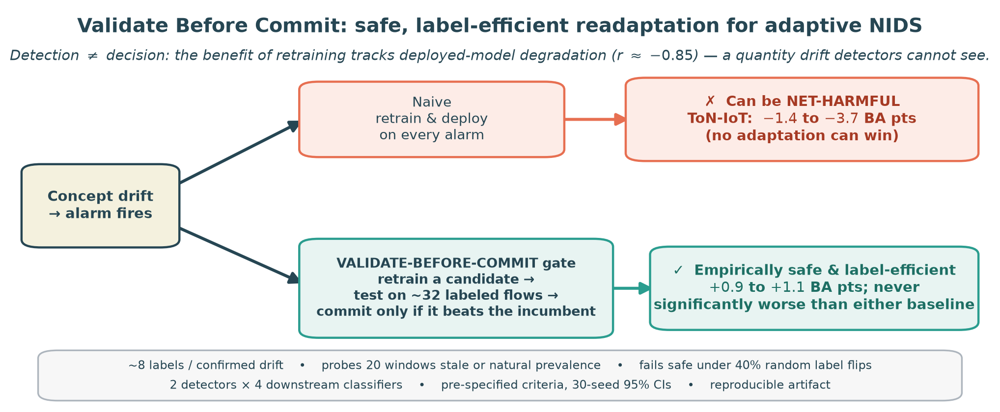
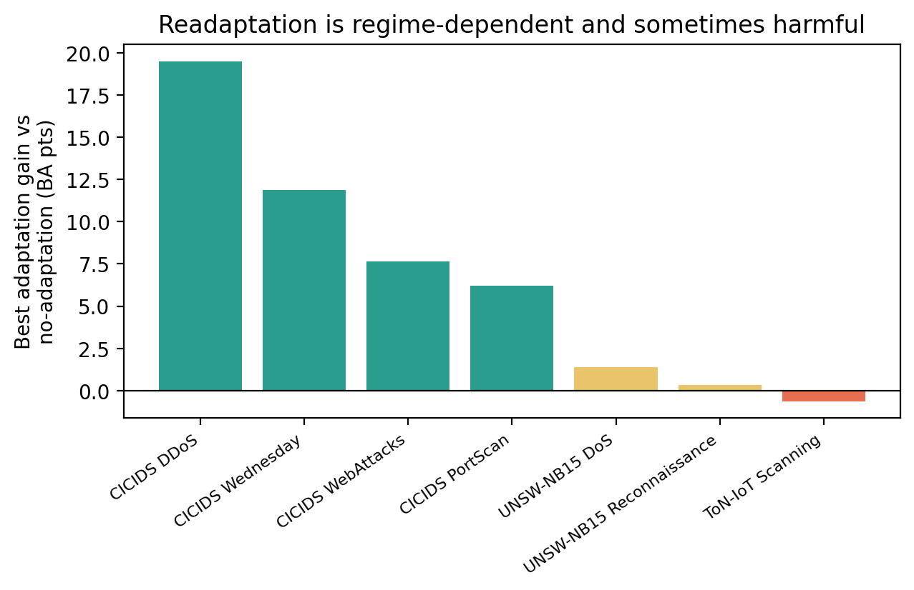
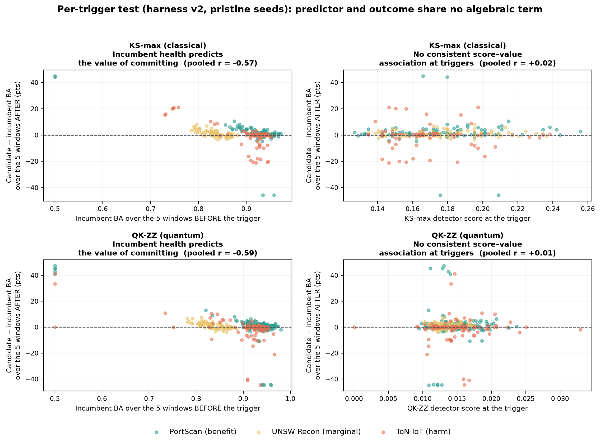
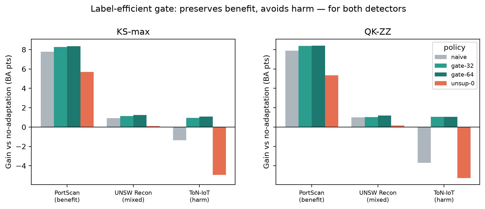
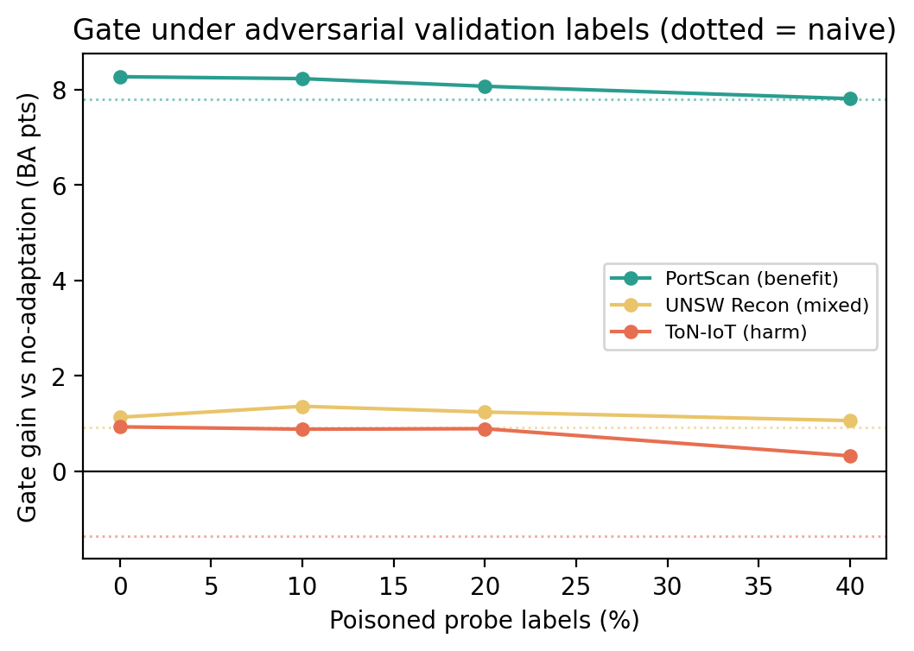

# Validate Before Commit

**Label-Efficient Commit Decisions for Drift-Triggered Classifier Updates in Network Intrusion Detection**


[](https://doi.org/10.5281/zenodo.21322256)



Machine-learning intrusion detectors degrade under network **concept drift**, so adaptive systems retrain their
classifiers. The field treats model updating as a **drift-detection** problem: fire a monitor, retrain on the
alarm, deploy. This repository shows that the ungoverned step is the *deployment*: always deploying the
retrained candidate is incomplete and sometimes harmful — and a small commit-time check fixes it.

> **Drift detectors answer "did the distribution change?". An adaptive IDS needs "will deploying this retrained
> candidate improve the classifier?". These are different questions — and the gap between them is where harmful
> updates live.**

---

## TL;DR

- Across **three public benchmarks** (CICIDS2017, UNSW-NB15, ToN-IoT) and multiple attack regimes, the value of
  drift-triggered retraining spans **+19.5 to −4.6 balanced-accuracy points**. For a fragile downstream model,
  *never adapting* can beat every triggered strategy.
- Whether an update helps tracks **how degraded the deployed model already is**: retraining restores
  accuracy to a nearly regime-invariant level, so the benefit is the deployed model's *headroom* — a quantity
  drift-detector scores do not measure (at individual triggered decisions a hierarchical model clustered
  on regime×seed gives β_deg = −1.02 [−1.61, −0.43] vs β_score ≈ 0). The detector — classical two-sample test or quantum-kernel
  MMD — is **not the lever** in any regime we evaluated: improving the monitor did not improve the update decision.
- **Harm is a condition, not a dataset:** a *registered prediction test* (locked before running) confirms the account's sharpest consequence — under mild drift, where the incumbent stays healthy, always-deploy turns negative in **all three benchmarks** (CICIDS −0.46, UNSW −0.15, ToN −0.65; statistically resolved in UNSW and ToN), while the gate stays within its pre-registered tolerance and beats naive in each.
- Simple confirmation/cooldown policies and a 50/50 replay strategy do **not** fix it (pre-specified negatives).
- **Candidate governance, not just drift detection:** a **validate-before-commit gate** — the loop retrains its
  candidate as usual, and the gate decides **deployment**: commit only if the candidate beats the incumbent on a
  small labeled probe (32 flows — the *decision's* incremental cost; candidates themselves consume ~1,024
  labels/trigger, fully accounted). A drift alarm is a *proposal generator*, not deployment evidence: whatever
  produces a proposal — true drift, a false alarm, or a scheduled retrain — the challenger should be validated
  before it replaces the incumbent. A **zero-drift control** makes the point: forcing updates on a healthy model
  is net-harmful *even with no drift at all* (the gate reduces, but does not eliminate, that replacement cost).
  Confirmed by a **replication registered before execution** on a hardened harness across two detectors and four
  downstream models, and by a **causal arm** (candidate, probe and detector recalibration from observed traffic only).
- **A named policy with a guarantee you can afford:** **VBC-SG** — stratified per-class anytime-valid bounds driving
  commit/reject/defer, plus a *deployment-long* risk budget. A registered budget frontier shows that guarantee is not
  vacuous: at a 512-flow probe cap a lifetime-budgeted pooled gate recovers **93% of always-deploying's benefit**
  under an approximate pooled analysis (81% for the fully stratified VBC-SG variant carrying the formal per-class
  guarantee) while committing **nothing at all** under zero drift. The mechanism behind the harm is named too — a role-randomized A/B
  control traces it to *who owns the preprocessing*, and a decomposition puts it in the **feature standardizer**
  (per-model scaling removes it; equivalence-tested on 100 fresh seeds).
- **Honest boundary:** across **13 chronologically ordered replays**, chronological net harm **never appears** — the
  paper's principal limit on external validity, stated as such. Where the incumbent collapses, always-deploy is
  excellent and the gate pays a real premium. On the healthy-incumbent timelines the picture is favorable but not
  universal: **point and strict gates outperform always-deploying on the two healthy UNSW timelines** (the
  no-additional-label strict rule by up to +2.8 points while committing 2.5 times per stream against naive's 13),
  VBC-SG does so on one of the two, and the healthy Wednesday intra-day replay remains an unresolved
  counterexample where the gates sit slightly below naive.
- **Attack-label acquisition yield, measured on the right sample:** at operating prevalence the honest unit for
  *finding attack labels* is inspected flows, not adjudicated labels. Alert-guided inspection finds an attack
  **5–8× more cheaply** than random inspection; ranking by candidate/incumbent disagreement barely helps (a
  negative we report as it came out). The adjudication budget is split so that discovery yield and decision
  validity are never measured on the same sample: an auxiliary enriched **discovery** half prices the search,
  while an independent uniform **validation** half at operating prevalence is the only sample the commit rule
  ever sees (32 adjudications per decision — enrichment does not reduce or cheapen them). The candidate training
  batch remains balanced per class and its acquisition cost is not modeled, so this arm is an acquisition-yield
  simulation, not a fully end-to-end operational evaluation.
- **Every commit is scored, including the deferred ones:** each risk gate logs the *real* resolution window of
  every proposal, so harmful-commit rates cover commits that took effect several windows after they were raised,
  with end-of-stream cases declared censored rather than counted as harmless.

---

## Key findings

**1 — Readaptation is regime-dependent and sometimes harmful.**



**2 — Retraining restores accuracy to a nearly regime-invariant level, so the benefit of an update tracks the deployed
model's headroom. Per-trigger, non-coupled test (hardened harness): pre-trigger incumbent degradation predicts the
future value of committing, while the detector score at the same triggers shows no consistent signal (both KS-max and
QK-ZZ; one small exception in QK/PortScan is reported in the paper). Coupling-aware analysis in Supplement §S1.1;
hierarchical model in the paper, §5.3.**



**3 — In the three controlled regimes, the validate-before-commit gate preserves benefit, avoids net harm, and beats
naive retraining in the harm regime — with the same sign pattern for a classical (KS-max) and a quantum (QK-ZZ)
detector. It is not a dominant policy: no policy dominates the accuracy–labels–updates frontier (paper, policy-frontier table).**



**4 — The gate is harm-avoiding under randomly corrupted validation labels: at up to 40% flipped labels it stays
significantly above naive in the harm regime; net benefit over no-adaptation survives to 25% (hardened-harness
numbers in the paper, §5.3).**



---

## Results at a glance (ToN-IoT harm regime — registered replication, harness v2, pristine seeds 104–133)

| Detector | naive (always deploy) | **validate-before-commit gate** | gate vs naive (CI95) | gate vs never-adapt (CI95) |
|---|---:|---:|---|---|
| KS-max (classical) | −1.64 | **+0.79** | +2.43 [1.53, 3.43] | +0.79 [0.53, 1.07] |
| QK-ZZ (quantum) | −2.91 | **+0.72** | +3.63 [1.66, 6.38] | +0.72 [0.44, 0.99] |

Balanced-accuracy points vs. the shared no-adaptation baseline (truly paired: all arms process bit-identical
streams). The v2 **label-budget sweep** puts the operating point at b = 32: at b = 8 the gate still reduces harm
(+1.22 above naive) but is no longer net-positive vs never adapting — the initial study's "8 labels suffice" is
corrected accordingly. A **two-stage** variant health-checks the incumbent on a disjoint probe half *before*
training candidates (the earlier probe-reusing version was optimistically biased and is superseded): it cuts
total labels to roughly half of naive's (1,341 vs 2,594 per stream), stays significantly above naive
(+1.79 [0.69, 2.92]) — and its net gain over never adapting is honestly unresolved at 30 seeds (+0.15 [−0.15, 0.46]).
On an **external chronological stream** (raw UNSW-NB15 captures sorted by flow start time) the incumbent stays
healthy (82.3% BA) and the gate pays **no premium** (+0.16 [−0.31, 0.63] vs naive) — the insurance is free exactly
where the commit decision is genuinely uncertain.

---

## The method

On every triggered drift the loop retrains a **candidate** model as usual; the gate decides **deployment**:
commit only if the candidate beats the incumbent on a small labeled probe drawn from current traffic (default
32 flows); otherwise the incumbent is kept. A **two-stage** variant spends the same probe on the incumbent
*before* training and skips candidate construction when the incumbent is healthy — gating the training decision
itself (and its ~1,024 labels). Ablations delimit the method: among the evaluated gates, the label-free variants
(disagreement, ATC, DoC) either fail or sacrifice benefit; a properly *calibrated* soft ensemble is the strongest
label-free update rule (harm-avoiding everywhere, ahead of the gate in the marginal regime) but commits every
trigger and cannot decline an update; simple **k-of-n / cooldown** policies fail because they act on
distributional change rather than estimated model improvement. The named risk-controlled policy is
**VBC-SG** (Validate-Before-Commit Sequential Gate): stratified per-class empirical-Bernstein confidence
sequences driving commit/reject/defer, with an optional deployment-long alpha-spending budget. See
`manuscript/` §3 (Algorithm 1, §3.5) for the full specification.

Enabled by flags on the v2 runner (`src/experiments/run_paper2_readaptation_v2.py`):
`--adaptation-gate {none,labeled_probe,labeled_probe_holdout,labeled_probe_lcb,labeled_probe_mcnemar,labeled_probe_seq,labeled_probe_seqav,labeled_probe_cs,labeled_probe_ebcs,labeled_probe_strat,labeled_probe_ebcs_strat,labeled_probe_ebcs_defer,labeled_probe_exact_strat,vbc_sg,unsup_disagree,atc,doc,two_stage}`,
`--probe-size`, `--probe-latency`, `--probe-flip-frac`, `--probe-source {pools,observed}`,
`--probe-prevalence`, `--recal-source {pools,observed}`, `--gate-margin`, `--two-stage-delta`,
`--health-ref-mode {static,per_incumbent}`, `--seqav-alpha`, `--mcnemar-alpha`,
`--adapt-strategy {full_replace,ensemble,ensemble_cal,sliding_window,cumulative,replay}`,
`--cumulative-mode {observed,initial_plus_observed,dedup,cn}`, `--adapt-size-per-class`,
`--trigger-mode {detector,performance,ddm,adwin,ddm_river,adwin_river,random}`, `--trigger-prob`, `--max-severity`,
`--downstream-model {svc_rbf,random_forest,logreg,mlp}`, `--stream-prevalence`,
`--stream-disjoint-windows`, `--disjoint-window-frac`, `--min-calib-windows`, `--no-probe-policy {commit,reject}`,
`--lifetime-alpha`, `--lifetime-max-proposals`, `--alpha-spending {bonferroni,pseries}`, `--defer-windows`,
`--vbc-defer-mode {accumulate,cohort,refresh}` (what a DEFER continues on: same e-process at the current
mixture — weak conditional null, Proposition 1; same e-process at the proposal-time cohort; or fresh
per-window evidence at α/(1+D)), `--candidate-latency`.
The **observed-data (causal) gate** is `--probe-source observed --adapt-strategy sliding_window --recal-source observed`
(final leakage-free form adds `--stream-disjoint-windows --no-probe-policy reject --min-calib-windows 30`);
the **zero-drift control** is `--trigger-mode random --max-severity 0`; the **anytime-valid gates** are
`--adaptation-gate labeled_probe_ebcs` (pooled) and `labeled_probe_ebcs_strat` (stratified); the named policy is
`--adaptation-gate vbc_sg` (add `--lifetime-alpha 0.10 --alpha-spending {bonferroni,pseries}` for the
deployment-long budget).

---

## Repository structure

```
manuscript/     Manuscript (main.tex, CAS) + supplement.tex + references.bib
src/experiments/  Progressive-drift readaptation runner (detectors, gate, downstream models)
src/analysis/     Reproducible aggregation, statistics, tables and figures
results/          Generated tables/figures (mostly git-ignored; small confirmatory CSVs are
                  committed under results/tables/ and pinned by MANIFEST.sha256)
data/             Public benchmark datasets (git-ignored; see Data availability)
docs/img/         Figures used in this README
notes/            Protocols, pre-registrations, and checkpoints
tests/            Invariant tests run by `make final-paper` (disjointness, gate validity, claims)
REPRODUCE.md      One-command regeneration of every table and figure
```

## Reproducing the results

```bash
conda create -n paper2 python=3.11 -y && conda activate paper2
pip install -r requirements.txt
# place the datasets under data/ (see below), then:
python -m src.analysis.make_paper2_paper_tables    # Tables 1–6 (Markdown + LaTeX)
python -m src.analysis.make_paper2_figures         # Figures 1–4
python -m src.analysis.make_paper2_budget_curve    # label-efficiency frontier
python -m src.analysis.make_paper2_gate_robustness # latency / harm-breadth / margin / poison (v1)
python -m src.analysis.aggregate_paper2_v2_replication  # registered replication verdict (v2)
python -m src.analysis.aggregate_paper2_amendment_004   # robustness suite, cost table, temporal streams
python -m src.analysis.paper2_decision_quality_004      # decision metrics + hierarchical model
python -m src.analysis.validate_monitors_vs_river       # DDM/ADWIN vs reference implementations
```

A `requirements-lock.txt` (pip freeze of the environment that produced the results) accompanies
`requirements.txt` for exact reproduction.

Full details, including the exact experiment commands and a claim → artifact map, are in
[`REPRODUCE.md`](REPRODUCE.md). The **confirmatory evidence is the registered v2 replication**: protocol
publicly tagged (`harness-v2-protocol`) before any confirmatory seed ran, plus pre-run registered amendments
([002](notes/paper2_harness_v2_amendment_002.md), [003](notes/paper2_harness_v2_amendment_003.md),
[004](notes/paper2_harness_v2_amendment_004.md) — the latter also fixes and re-runs the chronological-stream
experiment). The initial Phase 2 protocol was pre-specified in
[`notes/paper2_phase2_gated_readaptation_preregistration_001.md`](notes/paper2_phase2_gated_readaptation_preregistration_001.md).

## Data availability

The three public benchmarks are **not redistributed** here (place them under `data/`):

- **CICIDS2017** — Sharafaldin, Lashkari & Ghorbani, *ICISSP* 2018.
- **UNSW-NB15** — Moustafa & Slay, *MilCIS* 2015.
- **ToN-IoT** — Alsaedi et al., *IEEE Access* 2020.

## Manuscript

The working manuscript (§1–§8) and its bibliography are in [`manuscript/`](manuscript/). Every derived
table, figure and numeric claim regenerates from this repository (`make reproduce`, or the full
`make final-paper`, whose audit re-verifies all 439 pinned numbers); the experiment commands that
populate `results/raw/` from the public datasets are enumerated in [`REPRODUCE.md`](REPRODUCE.md).

## Citation

The paper is under review; cite it as below. To cite the **software artifact** itself, use the Zenodo DOI
[10.5281/zenodo.21322256](https://doi.org/10.5281/zenodo.21322256) (metadata in `CITATION.cff`).

```bibtex
@unpublished{fernandezbarrios2026validate,
  title  = {Validate Before Commit: Label-Efficient Commit Decisions for
            Drift-Triggered Classifier Updates in Network Intrusion Detection},
  author = {Fern{\'a}ndez-Barrios, Roberto and Pastor-L{\'o}pez, Iker and
            Pikatza-Huerga, Amaia and Garc{\'i}a Bringas, Pablo},
  year   = {2026},
  note   = {Under review}
}
```

## License

The code and analysis scripts are released under the **MIT License** (see [`LICENSE`](LICENSE)).
Citation metadata for the artifact is provided in [`CITATION.cff`](CITATION.cff) and `.zenodo.json`.
